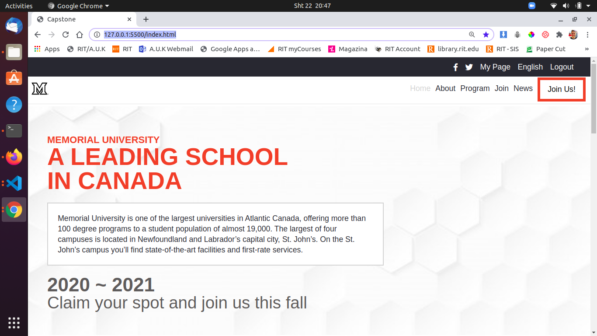

# Online-Conference-Page-Capstone-Project

## Built With

- HTML
- CSS
- Bootstrap

## Live Demo

[Live Demo Link](https://gracious-hermann-bdef87.netlify.app)

## Getting Started

Prerequisites for getting a local copy are Git, Github profile and Text editor

👤 **Author**

- Github: [GzimAsani](https://github.com/GzimAsani)
- Linkedin: [GzimAsani](https://www.linkedin.com/in/gzim-asani-83390a17a/)

## Contributing
---
Contributions, issues and feature requests are welcome!

Feel free to check the [Issue]() and help us improve!

# Acknowledgments

> The design that was given to me was designed by <a href="https://www.behance.net/adagio07"> Cindy Shin </a> and the design that I was given is <a href="https://www.behance.net/gallery/29845175/CC-Global-Summit-2015"> here </a>. I tried to follow the similar structure but by changing its content. My idea was to create a University page. My project consists three pages "Home", "About" and "Join us!"

- Hat tip to anyone whose code was used
- Inspiration
- etc

## Show your support

Give a ⭐️ if you like this project!

## 📝 License

All rights are reserved for the author.

